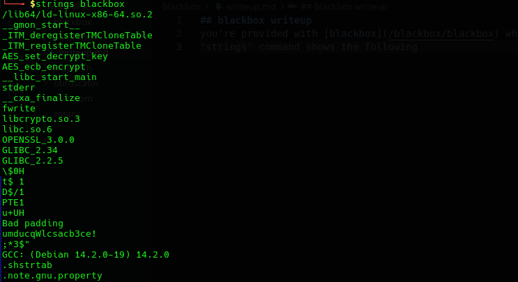
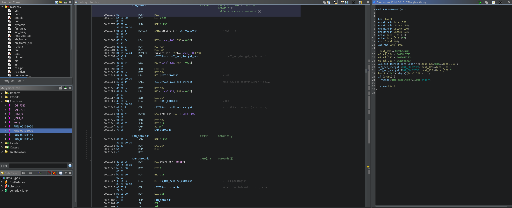
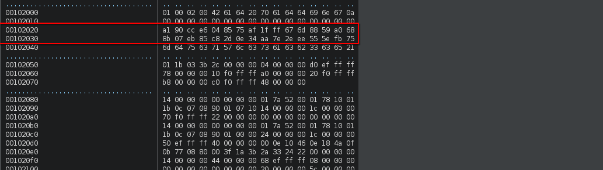
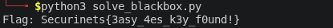

# blackbox writeup
you're provided with [blackbox](/blackbox/blackbox) which is a stripped linux x64 ELF.  
"strings" command shows the following  

 

as we can see strings shows some AES encryption and some weird ASCII "umducqWlcsacb3ce!"

so we will launch our ghidra and inspect the executable.



the decompiler provided the following :  

The key is provided as a single 16 bytes value broken across stack variables.  

local_138 = 0x6375646d;  

uStack_134 = 0x636c5771;  

uStack_130 = 0x62636173;  

uStack_12c = 0x21656333;  

Reassembling in correct order (the stack grows downward)  

So the full 16-byte key is:

6d 64 75 63 71 57 6c 63 73 61 63 62 33 63 65 21

As ASCII (where printable): mducqWlcsacb3ce! (which is the same weird ASCII we saw from strings)

That's the actual AES key used in the binary you analyzed.

and also we can see that the bytes that are used are stored in &DAT_00102020 and &DAT_00102030  

using BYTES window in ghidra we can view the data on these adresses  

  


now we can extract the data and decrypt it using a simple python script 

```python
#!/usr/bin/env python3

from Crypto.Cipher import AES

# AES key extracted from Ghidra (stack variables local_138, uStack_134, uStack_130, uStack_12c)
# In memory order: 6d 64 75 63 71 57 6c 63 73 61 63 62 33 63 65 21
key = bytes([
    0x6d, 0x64, 0x75, 0x63,  # "mduc"
    0x71, 0x57, 0x6c, 0x63,  # "qWlc"
    0x73, 0x61, 0x63, 0x62,  # "sacb"
    0x33, 0x63, 0x65, 0x21   # "3ce!"
])

# Encrypted flag from DAT_00102020 and DAT_00102030
encrypted_flag = bytes([
    0xA1, 0x90, 0xCC, 0xE6, 0x04, 0x85, 0x75, 0xAF,
    0x1F, 0xFF, 0x67, 0x6D, 0x88, 0x59, 0xA0, 0x68,
    0x8B, 0x07, 0xEB, 0x85, 0xC8, 0x2D, 0x0E, 0x34,
    0xAA, 0x7E, 0x2E, 0xEE, 0x55, 0x5E, 0xFB, 0x75
])

# Decrypt using AES-128-ECB
cipher = AES.new(key, AES.MODE_ECB)
decrypted = cipher.decrypt(encrypted_flag)

# Remove PKCS#7 padding
pad_len = decrypted[-1]
flag = decrypted[:-pad_len].decode('ascii')

print(f" {flag}")

```
which gives us the final flag 




