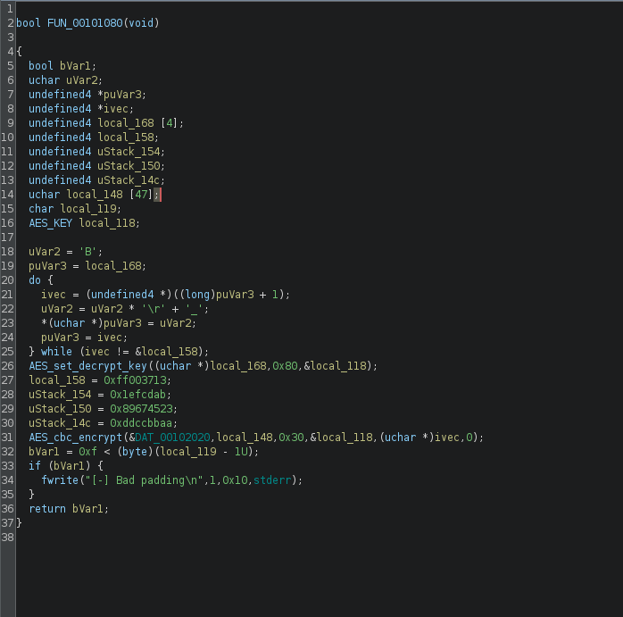
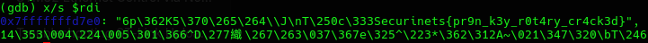

# rotary writeup 

we're given an ELF x64 [rotary](/rotary/rotary)

strings gives us a clue which is OpenSSL which is AES-128-CBCso we're using ghidra once again  



The disassembly doesn't provide much only 

- A loop generating 16 bytes at local_168 (the AES key)

- AES_set_decrypt_key using those 16 bytes

- AES_cbc_encrypt with:

- Ciphertext at DAT_00102020

- Length 0x30 (48 bytes)

- IV at ivec (which points to something)

- Padding check at the end

since static analysis doesn't provide much we'll switch to **dynamic analysis** using **GDB**

```bash
gdb ./rotary
break AES_cbc_encrypt
run
finish
x/s $rdi
```
we load the executable into GDB and set a breakpoint at the AEC_cbc_encrypt function that we saw from strings earlier after that we take a look at RDI register  

and finally we can see our flag  

